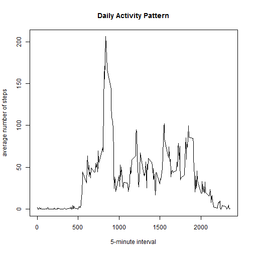
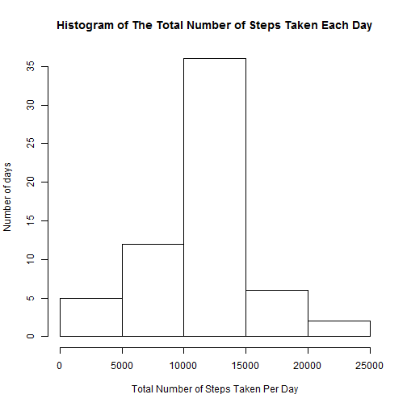

# Reproducible Research: Peer Assessment 1


## Loading and preprocessing the data

```r
zip_fname <- "activity.zip"
raw_file <- unzip(zip_fname, list=TRUE)$Name
zz <- read.csv(unz(zip_fname, as.character(raw_file)))

date <- split(zz$steps,zz$date)
interval <- split(zz$steps,zz$interval)
```


## What is mean total number of steps taken per day?
### Histogram

```r
sum_date <- lapply(date, sum, na.rm =TRUE)
temp <- c()

for(i in 1:length(sum_date)){
        temp <- c(temp, sum_date[[i]])        
}

hist(temp, xlab = "Total Number of Steps Taken Per Day", main ="Histogram of The Total Number of Steps Taken Each Day", ylab ="Number of days")
```

 

### Mean:

```r
mean(temp, na.rm =T)
```

```
## [1] 9354
```
### Median:

```r
median(temp, na.rm =T)
```

```
## [1] 10395
```
## What is the average daily activity pattern?
### Plot:

```r
mean_interval <- lapply(interval, mean, na.rm =TRUE)
temp1 <- c()

for(i in 1:length(mean_interval)){
        temp1 <- c(temp1, mean_interval[[i]])        
}
unique_interval <- unique(zz$interval)
plot(unique_interval,mean_interval, type ="l", main ="Daily Activity Pattern", xlab = "5-minute interval", ylab = "average number of steps")
```

 

### Max. No. of Steps:

```r
sum_interval <- lapply(interval, sum, na.rm =TRUE)
temp2 <- c()

for(i in 1:length(sum_interval)){
        temp2 <- c(temp2, sum_interval[[i]])        
}
index <- which(max(temp2) == temp2)
unique_interval[index]
```

```
## [1] 835
```

## Imputing missing values

### Total Number of missing values

```r
dim(zz)[1] - dim(zz[complete.cases(zz),])[1]
```

```
## [1] 2304
```
### i am planning to fill in all the of the missing values with the rounding value of the mean for that 5-minute interval

### New Dataset With The Missing Data In

```r
only_interval <- zz$interval
new_zz <- zz
for(i in 1 : length(only_interval)){
    if(is.na(zz[i,1]))
        new_zz[i,1] <- round(mean_interval[[as.character(only_interval[i])]])
}
```
### Histogram by New Dataset

```r
new_date <- split(new_zz$steps,new_zz$date)

new_sum_date <- lapply(new_date, sum, na.rm =TRUE)
new_temp <- c()

for(i in 1:length(new_sum_date)){
        new_temp <- c(new_temp, new_sum_date[[i]])        
}

hist(new_temp, xlab = "Total Number of Steps Taken Per Day", main ="Histogram of The Total Number of Steps Taken Each Day", ylab ="Number of days")
```

 
### Mean by New Dataset

```r
mean(new_temp, na.rm =T)
```

```
## [1] 10766
```
### Median by New Dataset

```r
median(new_temp, na.rm =T)
```

```
## [1] 10762
```
### Yes. It differs. the mean and the medin increases as i impute missing data. the number of days also increases for mean value also in respect to the previous result.

## Are there differences in activity patterns between weekdays and weekends?


